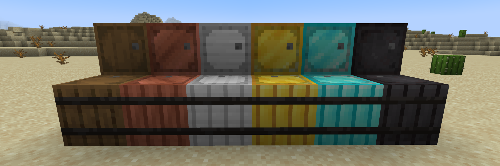
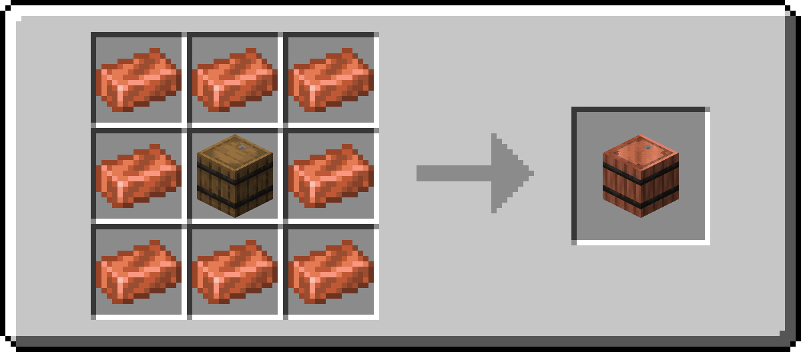
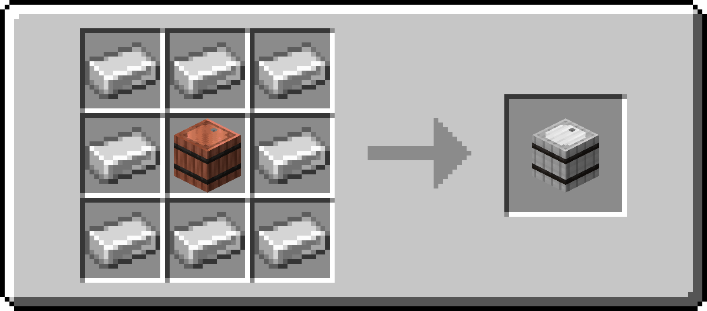
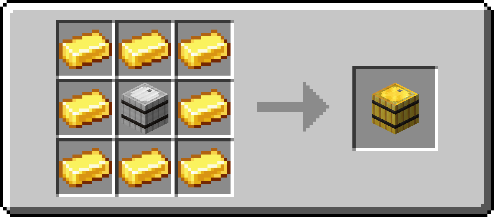
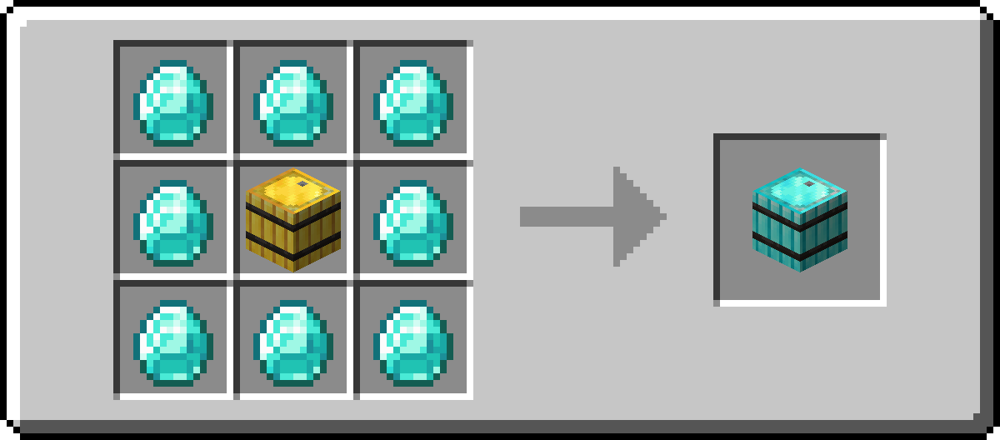
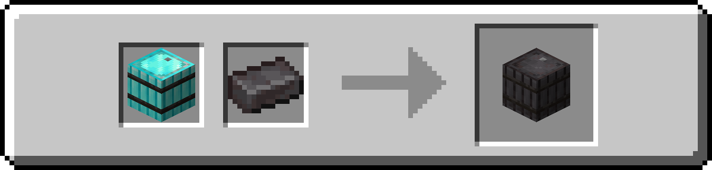

# Reinforced Barrels

The Reinforced Barrels mod adds reinforced barrels.

## Reinforced Storage Mod Series

- [Reinforced Chests](https://github.com/Aton-Kish/reinforced-chests)
- [Reinforced Shulker Boxes](https://github.com/Aton-Kish/reinforced-shulker-boxes)

## Recipe

| Name             | Type            | Ingredients                      | Recipe                                                                                                 | Description                                                                                             |
| ---------------- | --------------- | -------------------------------- | ------------------------------------------------------------------------------------------------------ | ------------------------------------------------------------------------------------------------------- |
| Copper Barrel    | Shaped Crafting | Barrel + Copper Ingot            |                 | A copper barrels has a container inventory with 45 slots.                                               |
| Iron Barrel      | Shaped Crafting | Copper Barrel + Iron Ingot       |                     | An iron barrels has a container inventory with 54 slots.                                                |
| Gold Barrel      | Shaped Crafting | Iron Barrel + Gold Ingot         |                     | A gold barrels has a container inventory with 81 slots.                                                 |
| Diamond Barrel   | Shaped Crafting | Gold Barrel + Diamond            |               | A diamond barrels has a container inventory with 108 slots.                                             |
| Netherite Barrel | Smithing        | Diamond Barrel + Netherite Ingot |  | A netherite barrel has a container inventory with 108 slots. This is resistant to blast, fire and lava. |

## License

The Reinforced Barrels mod is licensed under the MIT License, see [LICENSE](./LICENSE).
